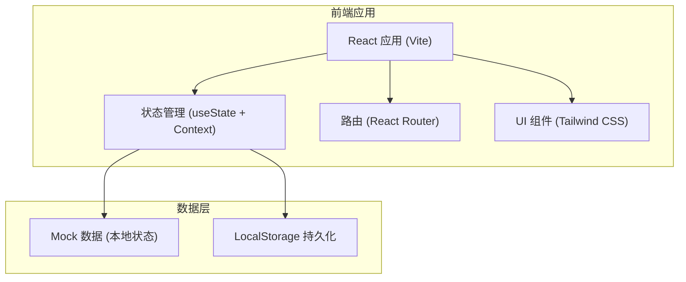
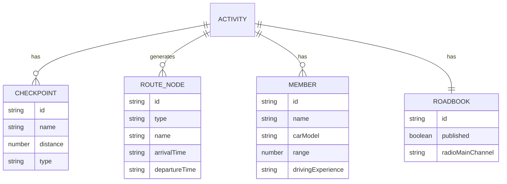

## 1. 架构设计



## 2. 技术选型

- **前端框架**：React@18 + TypeScript
- **构建工具**：Vite@5
- **样式方案**：TailwindCSS@3
- **路由管理**：React Router@6
- **图标库**：Lucide React
- **状态管理**：React Context + useState
- **数据持久化**：LocalStorage
- **开发语言**：TypeScript

## 3. 路由定义

| 路由 | 页面 | 说明 |
|------|------|------|
| / | 活动设置页 | 默认页，创建和编辑活动基本信息 |
| /members | 成员确认页 | 管理报名车主和智能分析 |
| /roadbook | 车队路书页 | 查看和发布车队路书 |

## 4. 数据模型

### 4.1 活动信息 (Activity)

```typescript
interface Activity {
  id: string;
  name: string;
  date: string;
  meetingPoint: string;
  meetingTime: string;
  vehicleCount: number;
  averageSpeed: number;
  accommodationBudget: number;
  checkpoints: Checkpoint[];
  nodes: RouteNode[];
  createdAt: string;
}
```

### 4.2 打卡点 (Checkpoint)

```typescript
interface Checkpoint {
  id: string;
  name: string;
  distance: number;
  type: 'scenic' | 'supply' | 'lunch' | 'other';
  stayDuration: number;
  notes?: string;
  order: number;
}
```

### 4.3 路线节点 (RouteNode)

```typescript
interface RouteNode {
  id: string;
  type: 'meeting' | 'driving' | 'lunch' | 'supply' | 'scenic' | 'accommodation' | 'rest';
  name: string;
  arrivalTime?: string;
  departureTime?: string;
  duration: number;
  distance?: number;
  notes?: string;
}
```

### 4.4 成员信息 (Member)

```typescript
interface Member {
  id: string;
  name: string;
  phone: string;
  carModel: string;
  carColor: string;
  range: number;
  drivingExperience: 'novice' | 'intermediate' | 'expert';
  hasElderly: boolean;
  hasChildren: boolean;
  willingTail: boolean;
  carNumber?: number;
  radioChannel?: string;
  status: 'confirmed' | 'pending' | 'cancelled';
  notes?: string;
}
```

### 4.5 路书 (Roadbook)

```typescript
interface Roadbook {
  id: string;
  activityId: string;
  published: boolean;
  publishedAt?: string;
  shareCode?: string;
  carRules: string[];
  latePolicy: string;
  radioMainChannel: string;
  radioEmergencyChannel: string;
  convoyOrder: string[];
}
```

### 4.6 ER 图



## 5. 目录结构

```
src/
├── components/          # 通用组件
│   ├── Layout.tsx       # 布局组件（侧边栏导航）
│   ├── Card.tsx         # 卡片组件
│   ├── Button.tsx       # 按钮组件
│   ├── Input.tsx        # 输入框组件
│   └── Badge.tsx        # 标签组件
├── pages/               # 页面组件
│   ├── ActivityPage.tsx # 活动设置页
│   ├── MembersPage.tsx  # 成员确认页
│   └── RoadbookPage.tsx # 车队路书页
├── context/             # 状态管理
│   └── AppContext.tsx   # 全局状态
├── types/               # 类型定义
│   └── index.ts         # 类型定义文件
├── utils/               # 工具函数
│   ├── timeCalculator.ts # 时间计算工具
│   └── analyzer.ts      # 成员分析工具
├── data/                # Mock 数据
│   └── mockData.ts      # 初始数据
├── App.tsx              # 应用入口
├── main.tsx             # React 入口
└── index.css            # 全局样式
```
